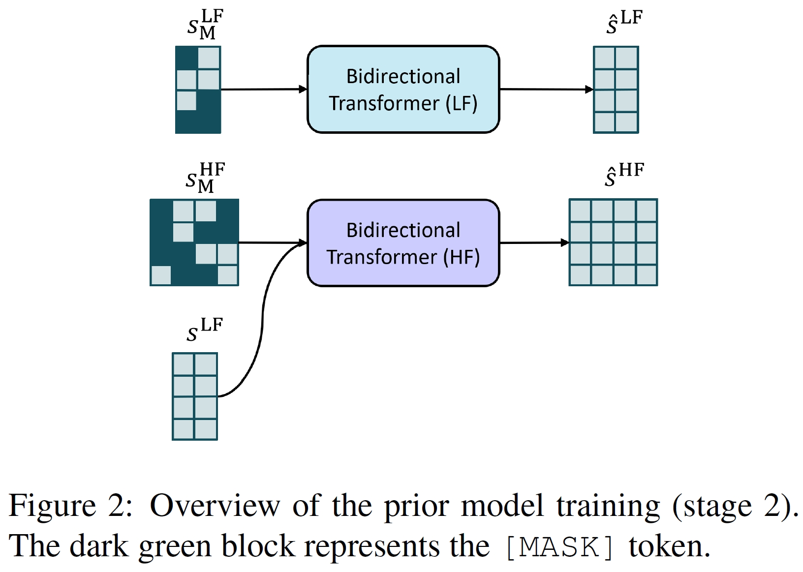
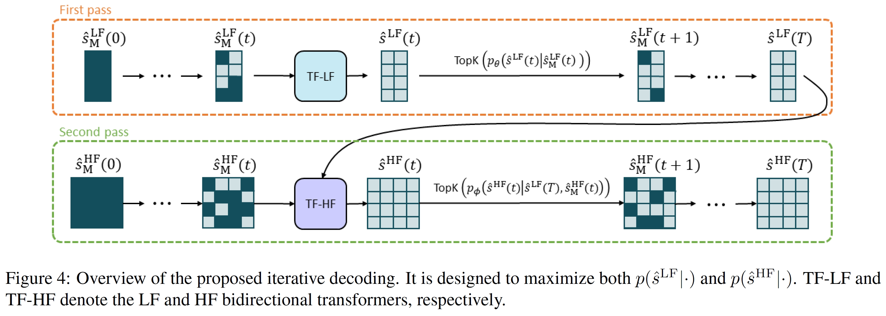
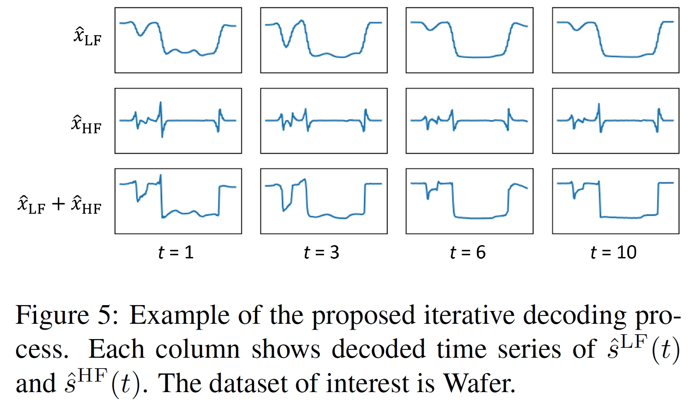
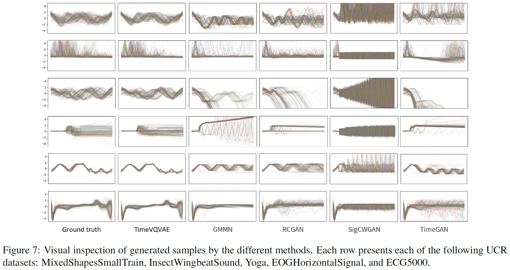
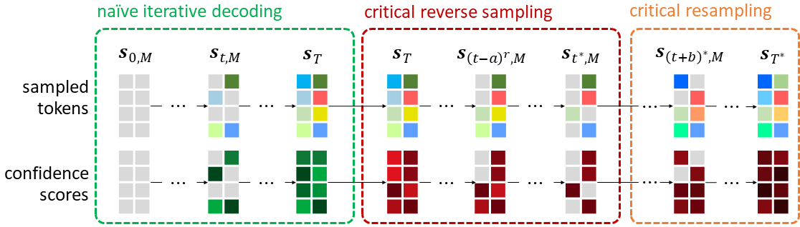
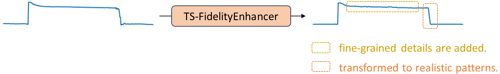

# TimeVQVAE
This is an official Github repository for the PyTorch implementation of TimeVQVAE from our paper ["Vector Quantized Time Series Generation with a Bidirectional Prior Model", AISTATS 2023](https://arxiv.org/abs/2303.04743).

TimeVQVAE is a robust time series generation model that utilizes vector quantization for data compression into the discrete latent space (stage1) and a bidirectional transformer for the prior learning (stage2).

<p align="center">

</p>

<p align="center">

</p>

<p align="center">

</p>

<!-- <p align="center">

</p>

<p align="center">

</p> -->

## Notes

The implementation has been modified for better performance and smaller memory consumption. Therefore, the resulting evaluation metrics are probably somewhat different from the repoted scores in the paper. We've done so to benefit the community for their practical use. For details, see the Update Notes section below.


## Install / Environment setup
You should first create a virtual environment, and activate the environment.
Then you can install the necessary libraries by running the following command.
```commandline
pip install -r requirements.txt
```

As for PyTorch, it was deveoped in `torch==2.5.1` with `pytorch-lightning==2.4.0`. You should install these yourself (not included in requirements.txt).


## Dataset and Dataset Download
The UCR archive datasets are automatically downloaded if you run any of the training command below such as `python stage1.py`. If you just want to download the datasets only without running the training, run
```commandline
python preprocessing/preprocess_ucr.py
```

[update note on July 8, 2024] We now use a larger training set by using the following re-arranged dataset: We reorganized the original datasets from the UCR archive by 1) merging the existing training and test sets, 2) resplitting it using StratifiedShuffleSplit (from sklearn) into 80% and 20% for a training set and test set, respectively.
We did so becaused the original datasets have two primary issues to be used to train a time series generative model. Firstly, a majority of the datasets have a larger test set compared to a training set. Secondly, there is clear difference in patterns between training and test sets for some of the datasets. The data format remains the same.
* original datasets: https://figshare.com/articles/dataset/UCR_Archive_2018/21359775
* re-organized datasets: https://figshare.com/articles/dataset/UCR_Archive_2018_resplit_ver_/26206355
* NB! the dataset directory should be located in `TimeVQVAE/datasets`. For instance, `TimeVQVAE/datasets/UCRArchive_2018` or `TimeVQVAE/datasets/UCRArchive_2018_resplit`.


## Usage

### Configuration
- `configs/config.yaml`: configuration for dataset, data loading, optimizer, and models (_i.e.,_ encoder, decoder, vector-quantizer, and MaskGIT)
- `config/sconfig_cas.yaml`: configuration for running CAS, Classification Accuracy Score (= TSTR, Training on Synthetic and Test on Real).

### Training: Stage1 and Stage2
```commandline
python stage1.py --dataset_names Wafer --gpu_device_ind 0
```

```commandline
python stage2.py --dataset_names Wafer --gpu_device_ind 0
```
The trained model is saved in `saved_models/`.
The details of the logged metrics are documented in `evaluation/README.md`.


<!-- :rocket: If you want to run stage 1 and stage 2 at the same time, use the following command. You can specify dataset(s) and a GPU device in the command line for `stages12_all_ucr.py`.
```commandline
python stage12_all_ucr.py --dataset_names CBF BME --gpu_device_idx 0
``` -->

### Evaluation
FID, IS, visual inspection between $p(X)$ and $p_\theta(\hat{X})$ with the corresponding comparison in an evaluation latent space.
```commandline
python evaluate.py --dataset_names Wafer --gpu_device_idx 0
```

### Run CAS (Classification Accuracy Score)

```commandline
python run_CAS.py  --dataset_names Wafer --gpu_device_idx 0
```

### Minimal Code for Sampling
Refer to `simple_sampling.ipynb`.


### Train it on a Custom Dataset
1. a template class, `DatasetImporterCustom`, is given in `preprocessing/preprocess_ucr.py`.
    - no need to modify any other code except `DatasetImporterCustom` to train TimeVQVAE on your dataset. 
2. write a data loading code for your dataset in `__init__` within `DatasetImporterCustom`.
3. run the following codes - stage1,2.

```commandline
python stage1.py --use_custom_dataset True --dataset_names custom --gpu_device_ind 0
```
```commandline
python stage2.py --use_custom_dataset True --dataset_names custom --gpu_device_ind 0
```
```commandline
python evaluate.py --use_custom_dataset True --dataset_names custom --gpu_device_idx 0
```
Also, you can sample synthetic time series with `custom_dataset_sampling.ipynb`.


## Google Colab
[](https://colab.research.google.com/github/ML4ITS/TimeVQVAE/blob/main/.google_colab/TimeVQVAE%20(generation%20only).ipynb) (NB! make sure to change your notebook setting to GPU.)

A Google Colab notebook is available for time series generation with the pretrained VQVAE. 
The usage is simple:
1. **User Settings**: specify `dataset_name` and `n_samples_to_generate`.
2. **Sampling**: Run the unconditional sampling and class-conditional sampling.

<!-- Note that the pretrained models are automatically downloaded within the notebook. In case you're interested, the pretrained models are stored in [here](https://figshare.com/articles/software/Pretrained_models_of_TimeVQVAE/22048034). -->

<!-- ## Remarks
* The full result tables for FID, IS, and CAS are available in `results/`. -->


## Update Notes

### Implementation Modifications

**[2024.12.06]**  
- Add weight normalization to the VQVAE model for better training stability.  
- Improve the Transformer implementation to fix previous bugs and enhance performance.  
- Use separable convolutional layers in the VQVAE.  
- Discard unused frequency bands in the stage 1 model (instead of zero-padding) to actually reduce the spatial dimensionality at the bottleneck.

**[2024.07.26]**  
- Modify encoder (E) and decoder (D) architectures so that their hidden dimension sizes increase incrementally with depth.  
- Employ a cosine annealing learning rate scheduler with linear warmup.  
- Apply reconstruction loss on the time domain only, while still modeling a discrete latent space derived from the time-frequency domain.

**[2024.07.23]**  
- Use the Snake activation function [6] in the encoder and decoder, replacing (Leaky)ReLU.  
- Improved reconstruction capability of VQVAE, especially beneficial for periodic time series like the FordA dataset.

**[2024.07.08]**  
- Switch to reorganized datasets described above instead of the original datasets.

**[2024.07.04]**  
- Enable FID score computation using ROCKET [5] representations (default setting) by setting `--feature_extractor_type rocket` in `evaluate.py`.  
- ROCKET provides unbiased, non-trained features, resulting in more robust PCA distributions and FID calculations.  
- Supports evaluation on custom datasets where supervised FCN cannot be used.

**[2024.07.02]**  
- Use convolution-based upsampling (nearest neighbor interpolation + conv) to replace the previous linear layer method for lengthening LF token embeddings.  
- Apply strong dropouts to LF and HF embeddings within `forward_hf` in `bidirectional_transformer.py` for robust sampling.  
- Use a smaller HF transformer to address overfitting issues.  
- Reduce `n_fft` from 8 to 4.

**[2024.07.01]**  
- Compute the prior loss only on masked token locations rather than the entire token set.

<!-- ### Enhanced Sampling Scheme (ESS) [2]
 We have published a [follow-up paper](https://arxiv.org/abs/2309.07945) [2] that enhances the sampling process by resolving its  existing limitations, which in turn results in considerably higher fidelity.
To be more precise, we first sample a token set with a naive iterative decoding (existing sampling process) and remove the less-likely tokens, and resample the tokens with a better realism approach for tokens.
The figure below illustrates the overview of [2].
<p align="center">

</p>

You can use it by setting `MaskGIT.ESS.use = True` in `configs/config.yaml`. -->


### Neural Mapper for Vector Quantized Time Series Generator (NM-VQTSG) [3]
It is a U-Net-based mapping model that transforms a synthetic time series generated by a VQ-based TSG method to be more realistic while retaining the original context.

<!-- <p align="center">

</p> -->

The model training is availble after finishing the stage1 and stage2 trainings. 
To train NM-VQTSG, run 
```commandline
python stage_neural_mapper.py  --dataset_names Wafer --gpu_device_ind 0
```

During the evaluation, NM-VQTSG can be employed by setting `--use_neural_mapper True`.
```commandline
python evaluate.py --dataset_names Wafer --gpu_device_idx 0 --use_neural_mapper True
```


### TimeVQVAE for Anomaly Detection (TimeVQVAE-AD) [4]
TimeVQVAE learns a prior, and we can utilize the learned prior to measure the likelihood of a segment of time series,
in which a high likelihood indicates a normal state while a low likelihood indicates an abnormal state (_i.e.,_ anomaly). 
With that principal, we have developed TimeVQVAE-AD. 
It not only achieves a state-of-the-art anomaly detection accuracy on [the UCR Anomaly archive](https://paperswithcode.com/dataset/ucr-anomaly-archive),
but also provides a high level of explainability, covering counterfactual sampling (_i.e.,_ to answer the following question, "how is the time series supposed look if there was no anomaly?").
If AD is your interest, please check out the paper.
Its open-source code is available [here](https://github.com/ML4ITS/TimeVQVAE-AnomalyDetection). 


## Citation
[1] Lee, Daesoo, Sara Malacarne, and Erlend Aune. "Vector Quantized Time Series Generation with a Bidirectional Prior Model." International Conference on Artificial Intelligence and Statistics. PMLR, 2023.

<!-- [2] Lee, Daesoo, Erlend Aune, and Sara Malacarne. "Masked Generative Modeling with Enhanced Sampling Scheme." arXiv preprint arXiv:2309.07945 (2023). -->

[3] Lee, Daesoo, Sara Malacarne, and Erlend Aune. "Closing the Gap Between Synthetic and Ground Truth Time Series Distributions via Neural Mapping." arXiv preprint arXiv:2501.17553 (2025).

[4] Lee, Daesoo, Sara Malacarne, and Erlend Aune. "Explainable time series anomaly detection using masked latent generative modeling." Pattern Recognition (2024): 110826.

[5] Dempster, Angus, François Petitjean, and Geoffrey I. Webb. "ROCKET: exceptionally fast and accurate time series classification using random convolutional kernels." Data Mining and Knowledge Discovery 34.5 (2020): 1454-1495.

[6] Ziyin, Liu, Tilman Hartwig, and Masahito Ueda. "Neural networks fail to learn periodic functions and how to fix it." Advances in Neural Information Processing Systems 33 (2020): 1583-1594.
