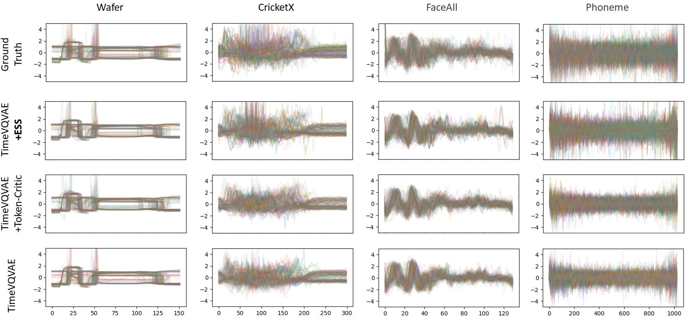

# TimeVQVAE
This is an official Github repository for the PyTorch implementation of TimeVQVAE from our paper ["Vector Quantized Time Series Generation with a Bidirectional Prior Model", AISTATS 2023](https://arxiv.org/abs/2303.04743).

TimeVQVAE is a robust time series generation model that utilizes vector quantization for data compression into the discrete latent space (stage1) and a bidirectional transformer for the prior learning (stage2).

<p align="center">

</p>

<p align="center">

</p>

<p align="center">

</p>

<p align="center">

</p>

<p align="center">

</p>

## Install / Environment setup
You should first create a virtual environment, and activate the environment.
Then you can install the necessary libraries by running the following command.
```commandline
pip install -r requirements.txt
```


## Dataset Download
The UCR archive datasets are automatically downloaded if you run any of the training command below such as `$ python stage1.py`.
If you just want to download the datasets only without running the training, run
```commandline
python preprocessing/preprocess_ucr.py
```


## Usage

### Configuration
- `configs/config.yaml`: configuration for dataset, data loading, optimizer, and models (_i.e.,_ encoder, decoder, vector-quantizer, and MaskGIT)
- `config/sconfig_cas.yaml`: configuration for running CAS, Classification Accuracy Score (= TSTR, Training on Synthetic and Test on Real).

### Run
:rocket: The stage 1 and stage 2 training can be performed with the following command: 
```commandline
python stage1.py --dataset_names TwoPatterns --gpu_device_idx 0
```
```commandline
python stage2.py --dataset_names TwoPatterns --gpu_device_idx 0
```

:bulb: The training pipeline is as follows:
- Run `stage1.py` and it saves trained encoders, decoders, and vector-quantizers for LF and HF.
- Run `stage2.py` and it saves the prior model (_i.e.,_ bidirectional transformer); `stage2.py` includes an evaluation step which is performed right after the stage 2 training. The evaluation includes a visualization plot of samples, FID score, and IS (Inception Score).    

<!-- :rocket: If you want to run stage 1 and stage 2 at the same time, use the following command. You can specify dataset(s) and a GPU device in the command line for `stages12_all_ucr.py`.
```commandline
python stage12_all_ucr.py --dataset_names CBF BME --gpu_device_idx 0
``` -->

:rocket: CAS can be performed with the following command:
```commandline
python run_CAS.py  --dataset_names TwoPatterns --gpu_device_idx 0
```

### Evaluation
The following code runs the evaluation step (the same evaluation step as the end of `stage2.py`).
```commandline
python evaluate.py --dataset_names TwoPatterns --gpu_device_idx 0
```
  

## Google Colab
[](https://colab.research.google.com/github/ML4ITS/TimeVQVAE/blob/main/.google_colab/TimeVQVAE%20(generation%20only).ipynb) (NB! make sure to change your notebook setting to GPU.)

A Google Colab notebook is available for time series generation with the pretrained VQVAE. 
The usage is simple:
1. **User Settings**: specify `dataset_name` and `n_samples_to_generate`.
2. **Sampling**: Run the unconditional sampling and class-conditional sampling.

Note that the pretrained models are automatically downloaded within the notebook. In case you're interested, the pretrained models are stored in [here](https://figshare.com/articles/software/Pretrained_models_of_TimeVQVAE/22048034).

## Remarks
* The full result tables for FID, IS, and CAS are available in `results/`.


## Update Notes

### Implementation Modifications
* [2024.07.01] compute the prior loss only on the masked locations, instead of the entire tokens.
* [2024.07.02] use a convolutional-based upsampling layer, (nearest neighbor interpolation - convs), to lengthen the LF token embeddings to match with the length of HF embeddings. Linear used to be used; Strong dropouts are used to the LF and HF embeddings within `forward_hf` in `bidirectional_transformer.py` to make the sampling process robust; Small-sized HF transformer is used, shown to be sufficient with 1 layer and dim size of 32; frequency-independent encoder and decoder [4] are used for HF.


### Enhanced Sampling Scheme (ESS) [2]
 We have published a [follow-up paper](https://arxiv.org/abs/2309.07945) [2] that enhances the sampling process by resolving its  existing limitations, which in turn results in considerably higher fidelity.
To be more precise, we first sample a token set with a naive iterative decoding (existing sampling process) and remove the less-likely tokens, and resample the tokens with a better realism approach for tokens.
The figure below illustrates the overview of [2].
<p align="center">

</p>

The visual results are presented in the following figure:
<p align="center">

</p>

You can use it by setting `MaskGIT.ESS.use = True` in `configs/config.yaml`.


### Time Series FidelityEnhancer (TS-FidelityEnhancer) [3] (not relased yet)
We have published a follow-up paper that proposes, _TS-FidelityEnhancer_. 
It acts like a mapping function such that it transforms a generated time series to be more realistic while retaining the original context.
<p align="center">

</p>

To employ this, the stage1 training must've been finished. Then, you can train the fidelity enhancer by running 
```commandline
python stage_fid_enhancer.py  --dataset_names TwoPatterns --gpu_device_idx 0 --use_fidelity_enhancer True
```


### TimeVQVAE for Anomaly Detection (TimeVQVAE-AD) [4]
TimeVQVAE learns a prior, and we can utilize the learned prior to measure the likelihood of a segment of time series,
in which a high likelihood indicates a normal state while a low likelihood indicates an abnormal state (_i.e.,_ anomaly). 
With that principal, we have developed TimeVQVAE-AD. 
It not only achieves a state-of-the-art anomaly detection accuracy on [the UCR Anomaly archive](https://paperswithcode.com/dataset/ucr-anomaly-archive),
but also provides a high level of explainability, covering counterfactual sampling (_i.e.,_ to answer the following question, "how is the time series supposed look if there was no anomaly?").
If AD is your interest, please check out the paper.


## Citation
```
[1]
@inproceedings{lee2023vector,
  title={Vector Quantized Time Series Generation with a Bidirectional Prior Model},
  author={Lee, Daesoo and Malacarne, Sara and Aune, Erlend},
  booktitle={International Conference on Artificial Intelligence and Statistics},
  pages={7665--7693},
  year={2023},
  organization={PMLR}
}

[2]
@article{lee2023masked,
  title={Masked Generative Modeling with Enhanced Sampling Scheme},
  author={Lee, Daesoo and Aune, Erlend and Malacarne, Sara},
  journal={arXiv preprint arXiv:2309.07945},
  year={2023}
}

[3]

[4] 
@article{lee2023explainable,
  title={Explainable Time Series Anomaly Detection using Masked Latent Generative Modeling},
  author={Lee, Daesoo and Malacarne, Sara and Aune, Erlend},
  journal={arXiv preprint arXiv:2311.12550},
  year={2023}
}
```
