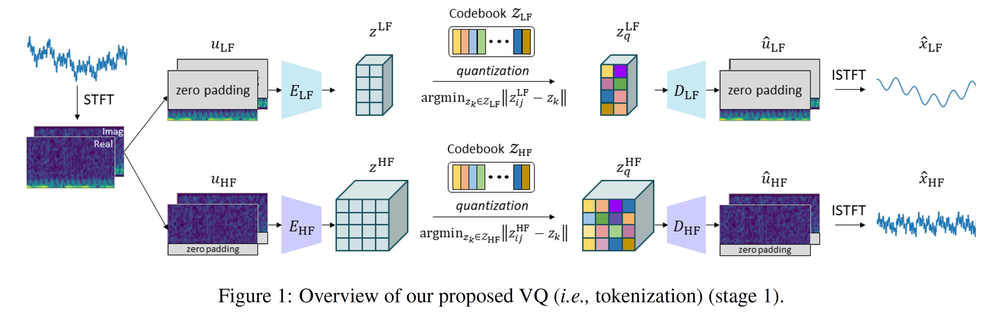

# TimeVQVAE
This is an official Github repository for the PyTorch implementation of TimeVQVAE from our paper ["Vector Quantized Time Series Generation with a Bidirectional Prior Model", AISTATS 2023](https://arxiv.org/abs/2303.04743).

TimeVQVAE is a robust time series generation model that utilizes vector quantization for data compression into the discrete latent space (stage1) and a bidirectional transformer for the prior learning (stage2).

<p align="center">

</p>

<p align="center">

</p>

<p align="center">

</p>

<p align="center">

</p>

<p align="center">

</p>

## Install / Environment setup
The following command creates the conda environment from the `environment.yml`. The installed environment is named `timevqvae`.
```commandline
$ conda env create -f environment.yml
```
You can activate the environment by running
```commandline
$ conda activate timevqvae
```

## Dataset Download
The UCR archive datasets are automatically downloaded if you run any of the training command below such as `$ python stage1.py`.
If you just want to download the datasets only without running the training, run
```commandline
$ python preprocessing/preprocess_ucr.py
```


## Usage

### Configuration
- `configs/config.yaml`: configuration for dataset, data loading, optimizer, and models (_i.e.,_ encoder, decoder, vector-quantizer, and MaskGIT)
- `config/sconfig_cas.yaml`: configuration for running CAS, Classification Accuracy Score (= TSTR, Training on Synthetic and Test on Real).

### Run
:rocket: The stage 1 and stage 2 training can be performed with the following command: 
```commandline
$ python stage1.py   
```
```commandline
$ python stage2.py   
```
Note that you need to specify a dataset of your interest in `configs/config.yaml`.

:bulb: The training pipeline is as follows:
- Run `stage1.py` and it saves trained encoders, decoders, and vector-quantizers for LF and HF.
- Run `stage2.py` and it saves the prior model (_i.e.,_ bidirectional transformer).
  - `stage2.py` includes an evaluation step which is performed right after the stage 2 training. The evaluation includes a visualization plot of test samples (from a test set) versus generated samples, FID score, and IS (Inception Score).    

:rocket: If you want to run stage 1 and stage 2 at the same time, use the following command. You can specify dataset(s) and a GPU device in the command line for `stages12_all_ucr.py`.
```commandline
$ python stage12_all_ucr.py --dataset_names CBF BME --gpu_device_idx 0
```

:rocket: CAS can be performed with the following command:
```commandline
$ python run_CAS.py  --dataset_names CBF BME --gpu_device_idx 0
```

## Google Colab
[](https://colab.research.google.com/github/ML4ITS/TimeVQVAE/blob/main/.google_colab/TimeVQVAE%20(generation%20only).ipynb) (NB! make sure to change your notebook setting to GPU.)

A Google Colab notebook is available for time series generation with the pretrained VQVAE. 
The usage is simple:
1. **User Settings**: specify `dataset_name` and `n_samples_to_generate`.
2. **Sampling**: Run the unconditional sampling and class-conditional sampling.

Note that the pretrained models are automatically downloaded within the notebook. In case you're interested, the pretrained models are stored in [here](https://figshare.com/articles/software/Pretrained_models_of_TimeVQVAE/22048034).

## Remarks
* The full result tables for FID, IS, and CAS are available in `results/`.

## Citation
```
@inproceedings{lee2023vector,
  title={Vector Quantized Time Series Generation with a Bidirectional Prior Model},
  author={Lee, Daesoo and Malacarne, Sara and Aune, Erlend},
  booktitle={International Conference on Artificial Intelligence and Statistics},
  pages={7665--7693},
  year={2023},
  organization={PMLR}
}
```
